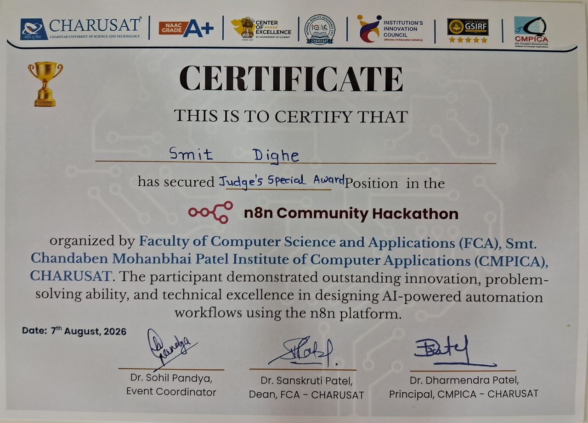

<p align="center">
  
</p>

<p align="center">
  <a href="https://smit-dighe-portfolio.vercel.app">
    
  </a>
  <a href="https://www.linkedin.com/in/smit-dighe-a02422337/">
    
  </a>
  <a href="mailto:smitdighe@gmail.com">
    
  </a>
</p>


## About

Engineering student who ships. I train the model, wrap it in an API, build the UI, and put it on the internet — the whole path, not just the notebook.

- Working across full-stack + applied ML: scikit-learn models, FastAPI services, React frontends
- Currently deep in **LangChain, LangGraph and multi-agent systems**
- 6 projects live in production, not just in a repo
- **Judge's Special Award** — n8n Community Hackathon @ CMPICA, CHARUSAT
- Shipped **Revvy**, an AI code reviewer, in under 48 hours at a hackathon


## Stack

<p align="center">
  
</p>

<details>
<summary><b>Full breakdown</b></summary>

<br />

| Layer | Tools |
| :--- | :--- |
| **Languages** | Python, TypeScript, JavaScript, C |
| **Frontend** | React, Vite, Tailwind, Bootstrap |
| **Backend** | FastAPI, Flask, Node.js, Express |
| **AI / ML** | LangChain, LangGraph, scikit-learn, SHAP, Groq, NumPy, Pandas |
| **Data** | PostgreSQL, Supabase, MySQL, SQLite |
| **Real-time** | Server-Sent Events, Uvicorn, PyGitHub |
| **Automation** | n8n |
| **Tooling** | Git, Docker, Postman, VS Code, Vercel |

</details>


## How FinDocAgent works

<p align="center">
  
</p>

A router plans which agents to call, a hybrid retriever pulls the relevant chunks out of parsed 10-K/10-Q filings, an analyst agent reasons over them and checks its own claims, and every sentence in the answer links back to the filing it came from.


## Projects

| Project | What it does | Live |
| :--- | :--- | :--- |
| **[FinDocAgent](https://fin-doc-agent.vercel.app/)** | Multi-agent RAG over SEC filings — cited answers, no hallucinated numbers | [](https://fin-doc-agent.vercel.app/) |
| **[Fathom](https://fathom-dev.vercel.app/)** | Autonomous research agent — searches, reflects on gaps, writes a cited report | [](https://fathom-dev.vercel.app/) |
| **[Undertow](https://undertow-dev.vercel.app/)** | AI incident triage — classifies, deduplicates and routes alerts to resolution | [](https://undertow-dev.vercel.app/) |
| **[Verity](https://verity-iota-two.vercel.app/)** | Job-posting fraud detector — LogisticRegression + SHAP so you see *why* it flagged | [](https://verity-iota-two.vercel.app/) |
| **[Revvy](https://revvy-iota.vercel.app/)** | AI pair reviewer — flags bugs, security holes and perf traps, ships the fix | [](https://revvy-iota.vercel.app/) |
| **[BinRoute](https://bin-route.vercel.app/)** | Live waste-collection command center for fleet managers | [](https://bin-route.vercel.app/) |

More in [my repositories](https://github.com/smitdighe?tab=repositories).


## Award

<table>
<tr>
<td width="62%">

**Judge's Special Award — n8n Community Hackathon**
*FCA, CMPICA, CHARUSAT*

Built an AI-powered helpdesk automation system in n8n: it reads incoming tickets, classifies them with an LLM, routes them to the right department, tracks SLA breaches in real time, auto-escalates the urgent ones, and writes trend reports for admins.

Defended every design decision under judge cross-questioning — including flagging records instead of deleting them, and the guardrails against prompt injection in the LLM calls.

</td>
<td width="38%" align="center">



</td>
</tr>
</table>


## Activity

<p align="center">
  
</p>

<p align="center">
  
</p>


<details>
<summary><b>How this README builds itself</b></summary>

<br />

Every animated graphic here is generated by [`scripts/gen_svg.py`](./scripts/gen_svg.py) and committed by a [GitHub Action](./.github/workflows/readme-assets.yml) on a daily cron. No third-party image hosts, so nothing rate-limits or renders blank.

- `header.svg` — stroke-drawn wordmark + drifting particles
- `orbit.svg` — stack labels on three counter-rotating rings
- `commit-race.svg` — contributions per month, pulled from the GitHub GraphQL API
- `divider.svg` — gradient sweep
- `findocagent-flow.svg` — hand-authored, agents light up in sequence

Animation is pure SMIL, theming is a `prefers-color-scheme` block inside each SVG. Stdlib Python only.

```bash
GH_LOGIN=smitdighe GITHUB_TOKEN=$YOUR_PAT python scripts/gen_svg.py
```

</details>
