  

  
  
  
  

## About

Engineering student who ships. I train the model, wrap it in an API, build the UI, and put it on the internet — the whole path, not just the notebook.

- Working across full-stack + applied ML: scikit-learn models, FastAPI services, React frontends
- Currently deep in **LangChain, LangGraph and multi-agent systems**
- 6 projects live in production, not just in a repo
- **Judge's Special Award** — n8n Community Hackathon @ CMPICA, CHARUSAT
- Shipped **Revvy**, an AI code reviewer, in under 48 hours at a hackathon

## Stack

  

  <a href="https://smit-dighe-portfolio.vercel.app"><b>interactive version on my portfolio &rarr;</b></a>

<b>Full breakdown</b>

 

| Layer | Tools |
| :--- | :--- |
| **Languages** | Python, TypeScript, JavaScript, C |
| **Frontend** | React, Vite, Tailwind, Bootstrap |
| **Backend** | FastAPI, Flask, Node.js, Express |
| **AI / ML** | LangChain, LangGraph, scikit-learn, SHAP, Groq, NumPy, Pandas |
| **Data** | PostgreSQL, Supabase, MySQL, SQLite |
| **Real-time** | Server-Sent Events, Uvicorn, PyGitHub |
| **Automation** | n8n |
| **Tooling** | Git, Docker, Postman, VS Code, Vercel |

## Projects

| Project | Description | Status |
|:--------|:------------|:------:|
| [📄 FinDocAgent](https://fin-doc-agent.vercel.app/) | A multi-agent RAG system over SEC filings | `🟢 LIVE` |
| [🔭 Fathom](https://fathom-dev.vercel.app/) | Autonomous research agent — searches, reflects, and writes fully cited reports | `🟢 LIVE` |
| [🌊 Undertow](https://undertow-dev.vercel.app/) | AI-driven incident triage system — classify, deduplicate, resolve | `🟢 LIVE` |
| [🛡️ Verity](https://verity-iota-two.vercel.app/) | ML job posting fraud detector — LogisticRegression + SHAP explainability | `🟢 LIVE` |
| [⚙️ Revvy](https://revvy-iota.vercel.app/) | AI pair reviewer — flags bugs, security holes, and performance traps with fixes | `🟢 LIVE` |
| [🗑️ BinRoute](https://bin-route.vercel.app/) | Live waste-collection command center for fleet managers | `🟢 LIVE` |

More in [my repositories](https://github.com/smitdighe?tab=repositories).

## Award

<table>
<tr>
<td width="62%">

**Judge's Special Award — n8n Community Hackathon**
*FCA, CMPICA, CHARUSAT*

Built an AI-powered helpdesk automation system in n8n: it reads incoming tickets, classifies them with an LLM, routes them to the right department, tracks SLA breaches in real time, auto-escalates the urgent ones, and writes trend reports for admins.

Defended every design decision under judge cross-questioning — including flagging records instead of deleting them, and the guardrails against prompt injection in the LLM calls.

</td>
<td width="38%" align="center">

</td>
</tr>
</table>

## Activity

  

 

  <picture>
    <source media="(prefers-color-scheme: dark)" srcset="./assets/pacman-contribution-graph-dark.svg" />
    <source media="(prefers-color-scheme: light)" srcset="./assets/pacman-contribution-graph.svg" />
    
  </picture>

